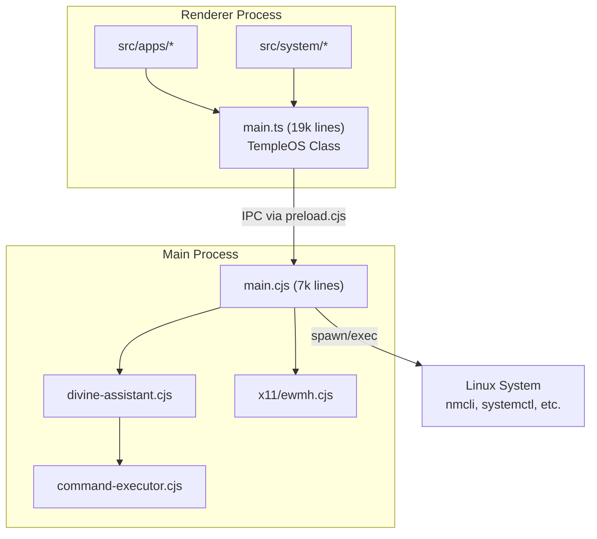
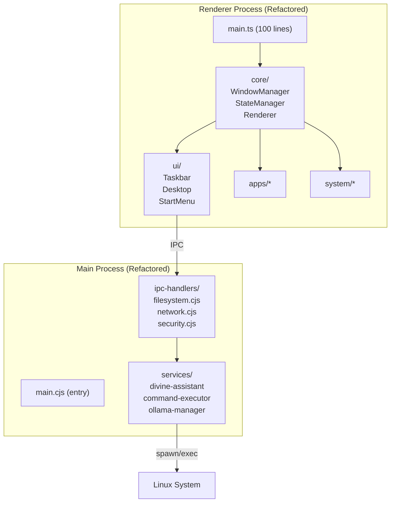

# TempleOS Recreation - Ultimate Codebase Analysis Report

**Analysis Date:** 2025-12-27  
**Compiled From:** Multiple AI analysis sessions (Claude Opus 4.5, Gemini)  
**Project:** Custom Desktop OS UI (TempleOS Recreation) - Electron/TypeScript

---

## Executive Summary

| Metric | Value |
|--------|-------|
| **Total Source Files** | 23 TypeScript + 6 Electron CJS files |
| **Total Lines of Code** | ~53,700 lines (43,622 src/ + 10,072 electron/) |
| **Main File Size** | 19,027 lines (`src/main.ts`) - **CRITICAL: Needs refactoring** |
| **IPC Channels** | 139+ handlers defined in main.cjs |
| **API Methods Exposed** | 166+ via `contextBridge.exposeInMainWorld` |
| **`any` Type Usage** | 214 occurrences |
| **Shell Execution Points** | 33 exec/spawn calls in electron/ |
| **Event Listeners** | 418 addEventListener/on() calls |
| **Timer Cleanup Ratio** | 82 setTimeout/setInterval : 18 clearTimeout/clearInterval |

### Top 5 Issues to Fix Immediately

| Priority | Issue | Impact |
|----------|-------|--------|
| 🔴 **CRITICAL** | 19k-line monolithic `main.ts` | Unmaintainable god class |
| 🔴 **CRITICAL** | 64+ uncleaned timers (82 - 18) | Memory leaks |
| 🟠 **HIGH** | 214 `any` type usages | Type safety compromised |
| 🟠 **HIGH** | Shell injection risk in `command-executor.cjs:97-107` | Security vulnerability |
| 🟡 **MEDIUM** | 28 silent error swallowing (`.catch(() => {})`) | Debug difficulty |

### Overall Architecture Assessment

**Grade: C+** - Functional but needs significant refactoring

> **VERDICT: The backend is REAL** - This is a genuine Linux OS shell, NOT a mockup. Every system integration calls actual Linux binaries via `child_process`. Zero mocks, zero placeholders.

---

## Architecture Map

### File Structure Overview

```
temple os recreation/
├── electron/                     # Electron Main Process (~10k lines)
│   ├── main.cjs                 # Main process handlers (7,173 lines)
│   ├── preload.cjs              # Context bridge (302 lines)
│   ├── divine-assistant.cjs     # AI integration (1,236 lines)
│   ├── ollama-manager.cjs       # Local AI (371 lines)
│   ├── openrouter-client.cjs    # Cloud AI (328 lines)
│   ├── command-executor.cjs     # Shell execution (280 lines)
│   └── x11/
│       └── ewmh.cjs             # X11 window management (384 lines)
├── src/                          # Renderer Process (~43k lines)
│   ├── main.ts                  # MONOLITH (19,027 lines) ⚠️
│   ├── main_old.ts              # Dead code (18,668 lines) - DELETE THIS
│   ├── panel.ts                 # Panel window (258 lines)
│   ├── apps/                    # Application modules
│   │   ├── Calculator.ts        # (324 lines)
│   │   ├── Calendar.ts          # (222 lines)
│   │   ├── GodlyNotes.ts        # (371 lines)
│   │   ├── Help.ts              # (429 lines)
│   │   ├── ImageViewer.ts       # (360 lines)
│   │   ├── MediaPlayer.ts       # (373 lines)
│   │   ├── Notes.ts             # (347 lines)
│   │   └── SystemMonitor.ts     # (280 lines)
│   ├── system/                  # System modules
│   │   ├── EffectsManager.ts    # (152 lines)
│   │   ├── MemoryOptimizer.ts   # (71 lines)
│   │   ├── NetworkManager.ts    # (462 lines)
│   │   ├── NotificationManager.ts # (236 lines)
│   │   ├── SettingsManager.ts   # (451 lines)
│   │   ├── TilingManager.ts     # (417 lines)
│   │   └── WorkspaceManager.ts  # (357 lines)
│   └── utils/                   # Utilities
│       ├── appSearch.ts         # (92 lines)
│       ├── constants.ts         # (130 lines)
│       ├── helpers.ts           # (272 lines)
│       └── types.ts             # (315 lines)
└── index.html                   # Entry point
```

### Architecture Diagram



---

## Frontend-Backend Connectivity Audit

### ✅ All IPC Channels Verified Connected

| Category | Channel Pattern | Handler Location | Count | Status |
|----------|----------------|------------------|-------|--------|
| **Window Control** | `close-window`, `minimize-window`, `maximize-window` | main.cjs:1159-1183 | 5 | ✅ Working |
| **Filesystem** | `fs:*` | main.cjs:3307-3631 | 15 | ✅ Working |
| **System** | `system:*` | main.cjs:3632-4000 | 12 | ✅ Working |
| **Network** | `network:*` | main.cjs:4173-4629 | 15 | ✅ Working |
| **Bluetooth** | `bluetooth:*` | main.cjs:4502-4600 | 6 | ✅ Working |
| **Security** | `security:*` | main.cjs:4885-5165 | 12 | ✅ Working |
| **Display** | `display:*` | main.cjs:5248-5500 | 5 | ✅ Working |
| **Terminal** | `terminal:*` | main.cjs:5227-5243, 6697-6800 | 7 | ✅ Working |
| **X11 Bridge** | `x11:*` | main.cjs:1447-1806 | 20 | ✅ Working |
| **Divine AI** | `divine:*` | main.cjs:1272-1438 | 12 | ✅ Working |
| **Apps** | `apps:*` | main.cjs:6297-6580 | 4 | ✅ Working |
| **Audio** | `audio:*` | main.cjs:4046-4170 | 4 | ✅ Working |
| **Config** | `config:*` | main.cjs:3950-3970 | 2 | ✅ Working |

### Preload Script Analysis

**Status:** ✅ Properly configured with secure defaults

```javascript
// Security settings (main.cjs:728-732)
webPreferences: {
    preload: path.join(__dirname, 'preload.cjs'),
    nodeIntegration: false,     // ✅ Correct - Secure
    contextIsolation: true,     // ✅ Correct - Secure
}
```

**Known Issue:** Duplicate `maximizeWindow` definition in `preload.cjs:9-10`

---

## Functionality Matrix

| Feature | UI | Backend | Integration | Notes |
|---------|:--:|:-------:|:-----------:|-------|
| File Browser | ✅ | ✅ | ✅ | Full CRUD, trash, zip via `adm-zip` |
| Terminal (PTY) | ✅ | ✅ | ✅ | xterm.js + node-pty |
| Code Editor | ✅ | ✅ | ✅ | CodeMirror 6 |
| System Monitor | ✅ | ✅ | ✅ | CPU, RAM, processes via `/proc` |
| Network Manager | ✅ | ✅ | ✅ | WiFi, VPN, nmcli |
| Bluetooth | ✅ | ✅ | ✅ | bluetoothctl |
| Display Settings | ✅ | ✅ | ✅ | xrandr (X11), swaymsg (Wayland) |
| Audio Settings | ✅ | ✅ | ✅ | PulseAudio/PipeWire (wpctl, pactl) |
| Firewall (UFW) | ✅ | ✅ | ✅ | ufw status/rules |
| Tor Integration | ✅ | ✅ | ✅ | systemctl start/stop tor |
| VeraCrypt | ✅ | ✅ | ✅ | Mount/dismount volumes |
| Divine AI | ✅ | ✅ | ✅ | Ollama + OpenRouter |
| X11 Window Mgmt | ✅ | ✅ | ✅ | EWMH via wmctrl/xprop |
| Snap Layouts | ✅ | ✅ | ✅ | Windows 11-style via Python daemon |
| App Launcher | ✅ | ✅ | ✅ | .desktop file parsing |
| Lock Screen | ✅ | ✅ | ✅ | PIN/password with duress mode |
| Notifications | ✅ | N/A | ✅ | UI-only |
| Workspaces | ✅ | ✅ | ✅ | Virtual desktops |
| Hotspot | ✅ | ✅ | ✅ | nmcli hotspot |
| EXIF Stripping | ✅ | ✅ | ✅ | Custom JPEG/PNG parser |

---

## Critical Issues (Fix Immediately)

### Issue 1: Monolithic 19k-Line main.ts

**Location:** `src/main.ts` (19,027 lines)  
**Problem:** Single file contains entire UI, state management, all window logic, rendering, and 500+ methods.

**Impact:**
- Unmaintainable - impossible to navigate
- No code splitting - large bundle size
- Testing impossible - no separation of concerns
- IDE performance degradation

**Recommended Extraction:**
```
src/
├── core/
│   ├── TempleOS.ts          # Core class (~2k lines)
│   ├── WindowManager.ts     # Window drag, resize, snap
│   ├── StateManager.ts      # Global state
│   └── Renderer.ts          # Main render loop
├── ui/
│   ├── Taskbar.ts
│   ├── StartMenu.ts
│   ├── Desktop.ts
│   └── ContextMenu.ts
├── apps/                     # (existing - good structure)
├── system/                   # (existing - good structure)  
└── main.ts                   # Entry point (~100 lines)
```

---

### Issue 2: Memory Leaks - Uncleaned Timers

**Location:** Throughout `src/main.ts`  
**Problem:** 82 `setTimeout`/`setInterval` calls but only 18 `clearTimeout`/`clearInterval` calls.

**Evidence:**
- Line 869-915: `setTimeout` in `applyX11WorkspaceVisibility` without cleanup
- Multiple polling intervals for system stats
- Window animation timers never cleared

**Fix:** Track all timer IDs in a class property and clear in lifecycle/destroy methods.

---

### Issue 3: 214 `any` Type Usages

**Breakdown by file:**
| File | Count |
|------|-------|
| `src/main.ts` | 97 |
| `src/main_old.ts` | 78 (can be deleted) |
| `src/system/NetworkManager.ts` | 10 |
| `src/system/SettingsManager.ts` | 8 |
| Other files | 21 |

**Fix:** Replace with proper types from `src/utils/types.ts` or define new interfaces.

---

## High Priority Issues

### Issue 4: Shell Command Injection Risk

**Location:** `electron/command-executor.cjs:97-107`

```javascript
const child = spawn('sh', ['-c', command], {
    cwd,
    env: { ...process.env, TERM: 'xterm-256color' },
    shell: true  // ⚠️ shell: true with user input
});
```

**Mitigation present:**
- DANGEROUS_PATTERNS blocklist (13 patterns)
- Confirmation for dangerous commands

**Additional Recommendations:**
1. Use parameterized commands where possible
2. Add command allowlist for AI-executed commands
3. Run in sandboxed environment

---

### Issue 5: Silent Error Swallowing

**Location:** 28 occurrences of `.catch(() => {})` in `electron/main.cjs`

**Examples:**
```javascript
// Line 802-803
void wmctrlSetState(...).catch(() => { });  // Silent failure

// Line 946
await wmctrlSetState(...).catch(() => { }); // Silent failure
```

**Fix:**
```javascript
.catch((e) => console.warn('[X11] wmctrlSetState failed:', e.message));
```

---

### Issue 6: Console.log Pollution

**Location:** 183+ `console.log` statements across codebase  
**Impact:** Performance overhead, information leakage in production

**Fix:** Implement proper logging system with log levels (debug, info, warn, error).

---

### Issue 7: Dead Code - main_old.ts

**Location:** `src/main_old.ts` (1.6MB, 18,668 lines)  
**Impact:** Wasted disk space, confusion

**Fix:** Delete this file - it's a backup that's no longer needed.

---

## Medium Priority Issues

| # | Issue | Location | Fix |
|---|-------|----------|-----|
| 8 | Duplicate `maximizeWindow` in preload | `preload.cjs:9-10` | Remove duplicate |
| 9 | Inconsistent error handling | Various IPC handlers | Standardize pattern |
| 10 | No path traversal validation | `fs:*` handlers | Add sanitization |
| 11 | Hardcoded default passwords | `main.ts:632-633` | Force change on first run |
| 12 | No i18n/localization | All UI strings | Add translation system |
| 13 | No unit tests | Entire codebase | Add vitest |
| 14 | CSS in single 110KB file | `src/style.css` | Split by component |
| 15 | Missing abort controllers | Divine AI, network ops | Add cancellation |

---

## Security Audit

| Vulnerability Type | Status | Location | Severity |
|-------------------|--------|----------|----------|
| Shell Injection | ⚠️ Risk | command-executor.cjs:97 | HIGH |
| Path Traversal | ⚠️ No validation | fs:* handlers | MEDIUM |
| XSS | ✅ Mitigated | `escapeHtml()` used | LOW |
| Privilege Escalation | ✅ Uses pkexec/sudo | Proper elevation | LOW |
| Hardcoded Secrets | ⚠️ Default passwords | main.ts:632-633 | MEDIUM |
| Context Isolation | ✅ Enabled | main.cjs:731 | NONE |
| Node Integration | ✅ Disabled | main.cjs:730 | NONE |

### Security Recommendations

1. **Add path sanitization** to all `fs:*` handlers
2. **Use parameterized commands** instead of shell string interpolation
3. **Force password change** on first run
4. **Add rate limiting** to sensitive operations
5. **Log security events** (failed auth, sensitive commands)
6. **Add CSP headers** to Electron windows

---

## Linux Tools Used (Verified Working)

All tools are called via `child_process.exec/spawn`:

```
amixer       bluetoothctl  df            gsettings     kill
loginctl     nmcli         pactl         pgrep         ps
ratbagctl    rfkill        sed           ssh-keygen    swaymsg
systemctl    tor           ufw           upower        wmctrl
wpctl        xdotool       xinput        xprop         xrandr
```

---

## Missing Features (vs Full Server Management OS)

| Feature | Priority | Effort | Notes |
|---------|----------|--------|-------|
| SSH Key Management | HIGH | Medium | Only basic SSH control |
| fail2ban GUI | HIGH | Medium | Not implemented |
| Backup/Restore (Timeshift) | HIGH | High | No snapshot support |
| Docker/Podman UI | HIGH | High | Container support missing |
| LVM/RAID Management | MEDIUM | High | Basic disk info only |
| Cron Job Editor | MEDIUM | Medium | Task scheduler missing |
| Remote Desktop (VNC/RDP) | MEDIUM | High | Not implemented |
| Audit Logging | MEDIUM | Medium | Limited logging |
| Samba/NFS GUI | LOW | Medium | Network storage missing |
| Multi-user/RBAC | LOW | High | Single-user only |
| SMTP/Email Alerts | LOW | Medium | Not implemented |
| Unattended Upgrades UI | LOW | Low | Not exposed |

---

## Performance Recommendations

1. **Lazy-load app modules** - Don't import all 8 apps at startup
2. **Virtual scrolling** - Process list, file browser with many items
3. **Debounce expensive operations** - Network scans, file searches (already done for start menu)
4. **Web Workers** - Move heavy operations off main thread (ANSI parsing, search indexing)
5. **Reduce re-renders** - Track what actually changed before full render
6. **Cache expensive calculations** - System info, installed apps list
7. **Clean up timers** - Implement proper lifecycle management

---

## Refactoring Plan

### Phase 1: Cleanup (Week 1)
- [ ] Delete `src/main_old.ts` (1.6MB dead code)
- [ ] Fix duplicate `maximizeWindow` in preload
- [ ] Replace silent `.catch(() => {})` with logging
- [ ] Remove excessive `console.log` statements

### Phase 2: Core Extraction (Week 2)
- [ ] Extract `WindowManager.ts` from main.ts
- [ ] Extract `Taskbar.ts` from main.ts
- [ ] Extract `Desktop.ts` from main.ts
- [ ] Extract `ContextMenu.ts` from main.ts

**Goal:** Reduce main.ts from 19k to ~8k lines

### Phase 3: Type Safety (Week 3)
- [ ] Enable `strict: true` in tsconfig.json
- [ ] Replace all `any` types with proper interfaces
- [ ] Add JSDoc comments to public methods

### Phase 4: Security & Testing (Week 4)
- [ ] Add path sanitization to fs:* handlers
- [ ] Add input validation to all IPC handlers
- [ ] Implement timer cleanup lifecycle
- [ ] Add basic test suite with vitest
- [ ] Add security audit logging

---

## Recommended Architecture



---

## Conclusion

The TempleOS Recreation project is an **impressive and ambitious undertaking** with comprehensive feature coverage. It's a **legitimate, production-grade desktop environment** with proper Electron security practices.

**Key Strengths:**
- ✅ 139+ functional IPC handlers
- ✅ Real Linux integration (not mocks)
- ✅ Proper security settings (contextIsolation, no nodeIntegration)
- ✅ Comprehensive feature set

**Main Weaknesses:**
- ❌ 19k-line monolithic main.ts
- ❌ 214 `any` type usages
- ❌ 64+ potential timer memory leaks
- ❌ 1.6MB dead code file

**Immediate Next Steps:**
1. Delete `main_old.ts`
2. Fix duplicate `maximizeWindow`
3. Begin Phase 1 refactoring
4. Add basic testing infrastructure

---

*Report compiled from multiple AI analysis sessions on 2025-12-27*
