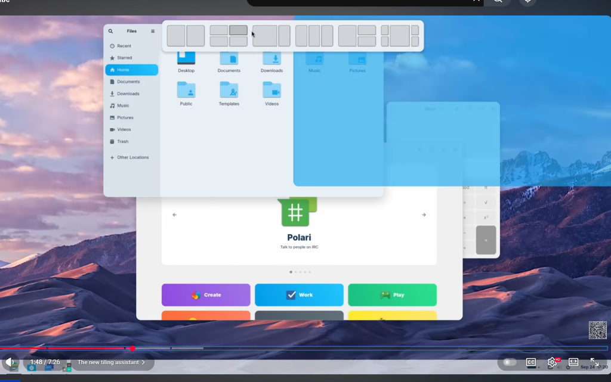
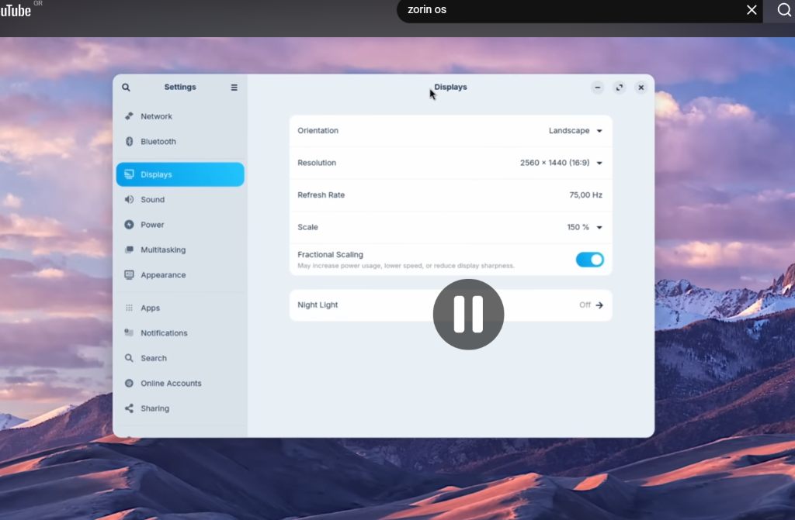
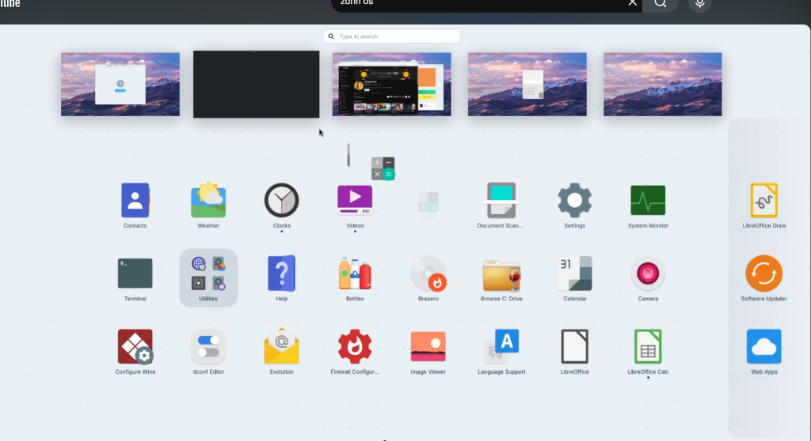
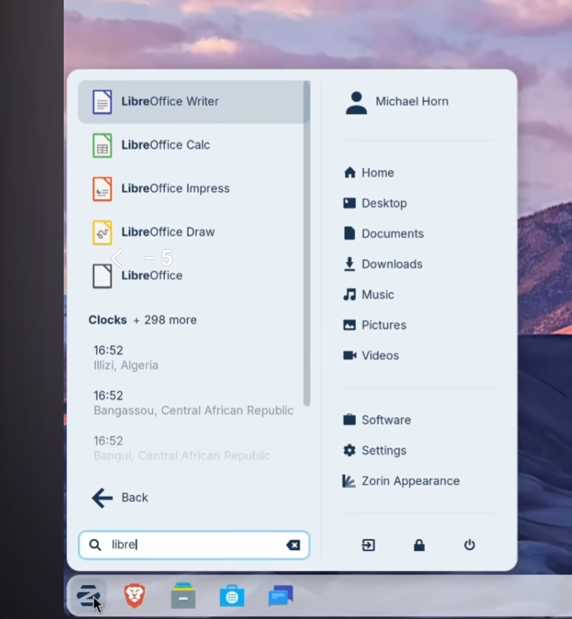
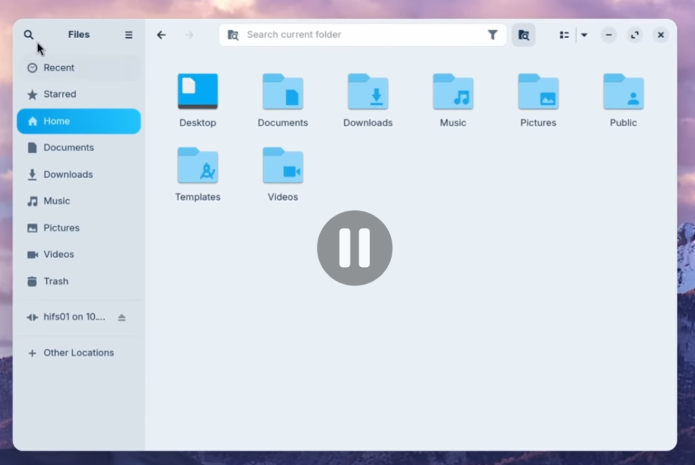

# Zorin OS 18 - Windows-like UX Research

## Overview

Zorin OS 18 is renowned for making Linux feel like Windows, reducing the learning curve for users migrating from Windows. Since we're building our own Electron shell on Ubuntu Server, we can implement similar concepts directly in our UI.

> **Note**: We're NOT using GNOME or the Zorin Appearance tool. Instead, we implement these features directly in our Electron/TypeScript shell.

---

## Visual References from Zorin OS

### 1. Tiling Assistant (Window Snapping)


**Key features to implement:**
- **Layout picker bar** appears at top when dragging window
- Multiple tiling options: half, quarters, thirds, custom layouts
- Visual preview shows where window will snap
- File browser has sidebar with: Recent, Starred, Home, Documents, Downloads, Music, Pictures, Videos, Trash, Other Locations
- Category tabs at bottom: Create, Work, Play (colored buttons)
- App carousel for featured apps (like Polari shown)

### 2. Settings Panel


**Settings categories to implement:**
- Network
- Bluetooth
- Displays (Orientation, Resolution, Refresh Rate, Scale, Fractional Scaling, Night Light)
- Sound
- Power
- Multitasking
- Appearance
- Apps
- Notifications
- Search
- Online Accounts
- Sharing

**Design notes:**
- Search icon at top left
- Clean sidebar navigation with icons
- Main content area for settings details
- Toggle switches for on/off settings
- Dropdown menus for options

### 3. Activities View / App Overview


**Key features to implement:**
- Search bar at top center ("Type to search")
- **Window previews** showing all open windows as thumbnails
- **App grid** below with large icons
- Apps organized in scrollable grid
- App categories with different colors
- Small dots under app icons (notification indicators or running status)

**Apps shown (for reference of what to include):**
- Contacts, Weather, Clocks, Videos, Document Scanner
- Settings, System Monitor, LibreOffice apps
- Terminal, Utilities, Help, Bottles (Wine)
- Brasero (disc burning), Browse C: Drive, Calendar, Camera
- Software Updater, Configure Wine, dconf Editor
- Evolution (email), Firewall, Image Viewer, Language Support
- Web Apps

### 4. Start Menu with Search


**Key features to implement:**

**Left Panel (Search Results):**
- Search bar at bottom with clear button
- Real-time search results as you type
- Results show: App icon + name (with search term highlighted)
- Shows app category + result count ("Clocks + 298 more")
- Additional context info (like world clocks with times/locations)
- Back button to return to main menu

**Right Panel (Quick Access):**
- User profile at top (name + icon)
- Quick folder access:
  - Home
  - Desktop
  - Documents
  - Downloads
  - Music
  - Pictures
  - Videos
- Divider line
- Software (app store)
- Settings
- Zorin Appearance (theme settings)
- Bottom icons: Switch user, Lock screen, Power/Shutdown

**Taskbar:**
- Zorin logo (start button)
- Pinned app icons
- Clean, minimal design

### 5. File Manager (Detailed View)


**Key features to implement:**

**Header Bar:**
- Search bar with "Search current folder" placeholder
- Filter icon next to search
- View mode toggle (grid/list icons)
- Window controls (minimize, maximize, close)

**Sidebar Navigation:**
- Recent (clock icon)
- Starred (star icon) - favorites system
- Home (house icon) - highlighted when active
- Documents (document icon)
- Downloads (download arrow icon)
- Music (music note icon)
- Pictures (image icon)
- Videos (video icon)
- Trash (trash bin icon)
- Network drives (like "hifs01 on 10..." with eject icon)
- Other Locations (+ icon)

**Main Content Area:**
- Large folder icons with labels
- Standard folders: Desktop, Documents, Downloads, Music, Pictures, Public, Templates, Videos
- Grid layout with consistent spacing
- Clean white/light background

**Design Notes:**
- Rounded corners on window
- Subtle shadows
- Blue accent color for selected items
- Monochrome icons in sidebar
- Blue folder icons in main view

---

## Key Windows-like Features to Implement

### 1. Taskbar (Panel) Design

**What Zorin Does**:
- Bottom taskbar with Start menu, pinned apps, system tray
- Taskbar shows running apps with icons
- System tray with clock, network, volume, notifications

**Our Implementation**:
- [x] Already have basic taskbar (Phase 1)
- [ ] Add pinned apps that persist
- [ ] App grouping (combine multiple windows of same app)
- [ ] Taskbar hover previews (show window thumbnail on hover)
- [ ] Right-click taskbar → taskbar settings
- [ ] Taskbar transparency/blur effect

---

### 2. Start Menu / App Launcher

**What Zorin Does**:
- Windows-style Start menu with search
- Recently used apps
- App categories
- Power options in menu

**Our Implementation**:
- [ ] Start menu triggered by Super key or click
- [ ] Search bar at top
- [ ] Pinned apps grid
- [ ] All apps list (scrollable)
- [ ] Recent documents
- [ ] Power menu (shutdown, restart, sleep)

---

### 3. Window Snapping (Snap Assist)

**What Zorin/Windows Does**:
- Drag window to edge → snaps to half screen
- Drag to corner → snaps to quarter screen
- Drag to top → maximizes
- Shows layout options when dragging

**Our Implementation**:
- [ ] Edge detection zones (left, right, top, corners)
- [ ] Visual indicator when dragging near edge
- [ ] Keyboard shortcuts: Win+Left, Win+Right, Win+Up
- [ ] Quarter-screen tiling (drag to corners)
- [ ] Layout picker (Windows 11 style - optional)

---

### 4. Alt+Tab / Window Switcher

**What Zorin/Windows Does**:
- Alt+Tab cycles through windows
- Shows window previews
- Alt+Shift+Tab goes backward

**Our Implementation**:
- [ ] Alt+Tab triggers window switcher overlay
- [ ] Show app icons and titles
- [ ] Keep holding Alt, press Tab to cycle
- [ ] Release Alt to switch
- [ ] Optional: full window previews

---

### 5. Desktop Icons & Organization

**What Zorin/Windows Does**:
- Icons on desktop that can be arranged
- Right-click desktop for options
- Auto-arrange option

**Our Implementation**:
- [x] Already have desktop icons (Phase 1)
- [ ] Icon grid snapping
- [ ] Auto-arrange toggle
- [ ] Right-click desktop → New folder, Refresh, Settings
- [ ] Icon size options

---

### 6. Context Menus (Right-Click)

**What Zorin/Windows Does**:
- Right-click everywhere for context actions
- Consistent styling

**Our Implementation**:
- [ ] Unified context menu component
- [ ] Desktop right-click menu
- [ ] File browser right-click menu
- [ ] Taskbar right-click menu
- [ ] Window title bar right-click menu

---

### 7. System Tray & Quick Settings

**What Zorin/Windows Does**:
- Icons in system tray for running apps
- Click clock → calendar
- Network/volume/battery quick toggles

**Our Implementation**:
- [x] Clock exists (Phase 1)
- [ ] Click clock → calendar popup
- [ ] Volume icon → slider popup
- [ ] Network icon → connection status
- [ ] Notification icon → notification center
- [ ] Quick settings panel (brightness, WiFi, bluetooth, etc.)

---

### 8. Notifications

**What Zorin/Windows Does**:
- Toast notifications in corner
- Notification center to see past notifications
- Do Not Disturb mode

**Our Implementation**:
- [ ] Toast notification component
- [ ] Notification center (panel that slides out)
- [ ] Notification history
- [ ] Clear all button
- [ ] DND mode

---

### 9. File Explorer Windows-like Features

**What Zorin/Windows Does**:
- Address bar with breadcrumbs
- Quick access sidebar (favorites)
- Search in folder
- View modes (icons, list, details)

**Our Implementation**:
- [ ] Breadcrumb navigation bar
- [ ] Sidebar with favorites (Downloads, Documents, etc.)
- [ ] Quick access section
- [ ] Search box
- [ ] View toggle (grid/list/details)
- [ ] Column headers for sorting

---

### 10. Keyboard Shortcuts (Windows-compatible)

**Standard Windows shortcuts to implement**:
| Shortcut | Action |
|----------|--------|
| Super (Win key) | Open Start menu |
| Alt+Tab | Switch windows |
| Alt+F4 | Close window |
| Win+E | Open File Explorer |
| Win+D | Show desktop |
| Win+L | Lock screen |
| Win+Left/Right | Snap window |
| Ctrl+Shift+Esc | Task manager |
| Win+X | Quick link menu |

---

### 11. Intellihide / Auto-hide Taskbar

**What Zorin Does**:
- Option to auto-hide taskbar
- Reappears on hover or when no windows overlap

**Our Implementation**:
- [ ] Auto-hide toggle in settings
- [ ] Show on hover (bottom edge)
- [ ] Show when no windows maximized
- [ ] Animation (slide in/out)

---

## Implementation Priority

### Phase 6A: Core Windows UX
1. Window snapping (half/quarter screen)
2. Alt+Tab window switcher
3. Start menu with search
4. Essential keyboard shortcuts

### Phase 6B: Polish
5. Context menus everywhere
6. System tray improvements
7. Notification center
8. Quick settings panel

### Phase 6C: Advanced
9. Taskbar previews on hover
10. Auto-hide taskbar
11. File explorer improvements
12. Full keyboard shortcut parity

---

## Technical Notes for Electron Implementation

### Window Snapping
```typescript
// Detect drag near screen edge
window.addEventListener('mousemove', (e) => {
  if (isDraggingWindow) {
    if (e.clientX < 20) showSnapPreview('left');
    if (e.clientX > window.innerWidth - 20) showSnapPreview('right');
    if (e.clientY < 20) showSnapPreview('maximize');
  }
});
```

### Alt+Tab Handler
```typescript
// Listen for Alt+Tab globally
window.addEventListener('keydown', (e) => {
  if (e.altKey && e.key === 'Tab') {
    e.preventDefault();
    showWindowSwitcher();
  }
});
```

### Start Menu Trigger
```typescript
// Super key detection (needs Electron main process)
globalShortcut.register('Super', () => {
  mainWindow.webContents.send('toggle-start-menu');
});
```

---

## References

- Zorin OS 18: Uses GNOME 46 + custom extensions
- Zorin Appearance: Their tool for switching layouts
- Dash to Panel: GNOME extension Zorin uses as taskbar base
- Arc Menu: GNOME extension for customizable start menu

**We don't use any of these** - we build everything in Electron/TypeScript ourselves, but we can learn from their UX patterns.

---

## Why This Matters

1. **Familiar UX** - Users know Windows, make it feel familiar
2. **Reduced Learning Curve** - Less friction for new users
3. **Professional Feel** - Windows patterns are well-tested UX
4. **TempleOS with Modern Comfort** - Keep the aesthetic, improve usability
